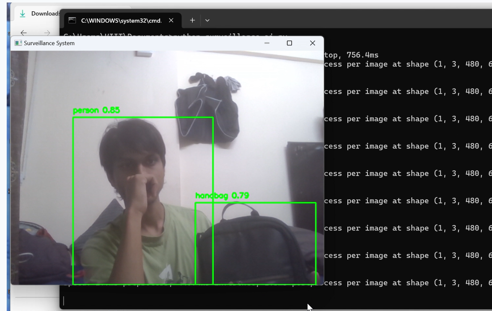
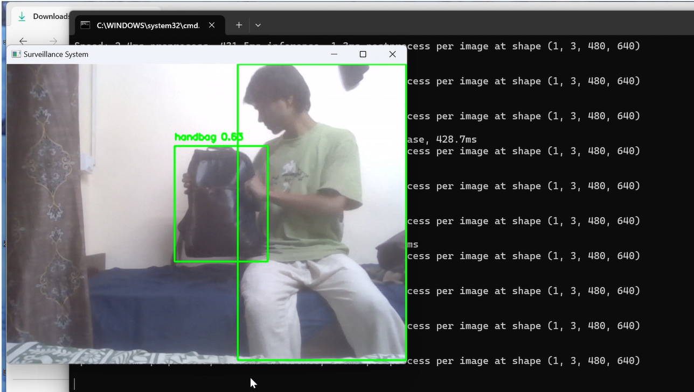

# AI Railway Surveillance System

AI-based surveillance system that detects unattended bags in crowded public environments such as railway stations using computer vision.

Developed as a B.Tech Telecommunications final-year project.

## Features
- Real-time video surveillance
- Object detection using YOLO
- Detection of unattended objects
- Alarm trigger system for alerts
- Security monitoring for public infrastructure

## Installation

Install required libraries:

pip install opencv-python ultralytics playsound numpy

## Run the project

python surveillance_ai.py

## Project Screenshots

### Detection Interface

### Object Tracking

### Suspicious Object Alert

## Future Improvements
- Real-time CCTV integration
- Object tracking with DeepSORT
- Cloud-based alert system
